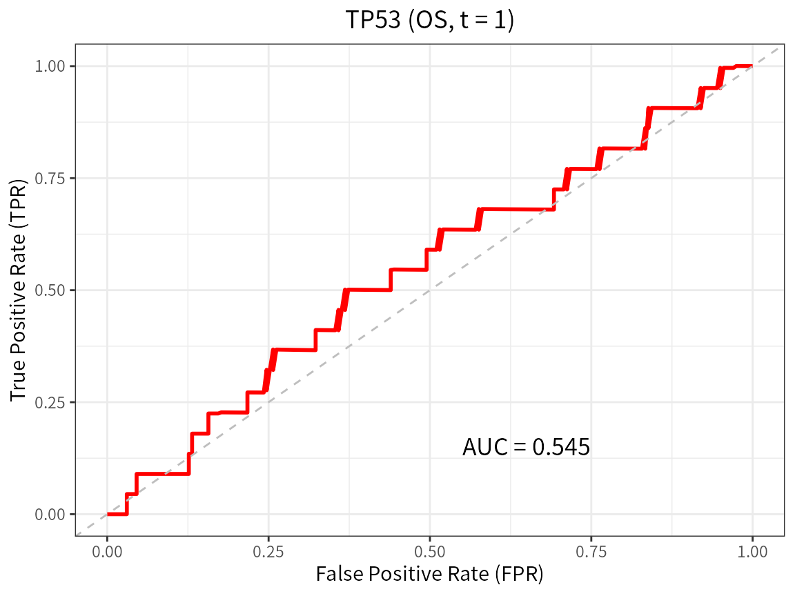

# Getting started with CanPAS

``` r
library(CanPAS)
```

## What the package is for

CanPAS runs one survival analysis over many public cancer cohorts and
one uniform data schema. A cohort is identified by its accession
(`GSE31210`, `TCGA-LUAD`, `CGGA_693`, …); an endpoint is requested by
**family** (`OS`, `DSS`, `DFS`, `PFS`, `MFS`) and the concrete endpoint
token a cohort actually reports (`RFS`, `PFI`, `DFI`, …) is resolved per
cohort and returned with every result. This vignette is deliberately
**offline**: it uses the shipped catalog and small synthetic cohorts so
that every number below is reproducible without a mirror, a network
connection or a download.

## The catalog

`dataset_info` is one row per curated cohort, with the sample-size
columns and the endpoint-family mapping.

``` r
di <- dataset_info
dim(di)
#> [1] 197  32
head(di[, c("Accession", "Type", "N", "EndpointFamilies")], 4)
#>   Accession        Type   N EndpointFamilies
#> 1  GSE14814 Lung Cancer 133           OS,DSS
#> 2   GSE8894 Lung Cancer 138              DFS
#> 3  GSE31210 Lung Cancer 226           OS,DFS
#> 4  GSE13213 Lung Cancer 117               OS
```

Which families a cohort can be analysed on, and with which token:

``` r
endpoint_options("TCGA-LGG")
#>   family token derived               label
#> 1     OS    OS   FALSE                  OS
#> 2    DSS   DSS   FALSE                 DSS
#> 3    DFS   DFI    TRUE DFS (DFI) [derived]
#> 4    PFS   PFI    TRUE PFS (PFI) [derived]
endpoint_resolve("GSE31210", "DFS")   # that cohort reports RFS, not DFS
#> [1] "RFS"
endpoint_resolve("TCGA-LUAD", "PFS")  # a TCGA-derived endpoint
#> [1] "PFI"
```

## Getting real data

On a machine that can reach the CanPAS mirror (or with the local
artefact tree present, via `CPAS_DATA_ROOT`), expression and survival
are fetched and merged in one call. These chunks are not evaluated here
because they need the mirror.

``` r
d <- cohort_merged("GSE31210", c("TP53", "GAPDH"), type = "DFS", clin = TRUE)
colnames(d)
```

``` r
# a signature instead of one gene: any R expression on the gene columns
d <- cohort_merged("GSE31210", NULL, type = "RFS", signature = "0.5*TP53+0.5*GAPDH")
```

## An end-to-end analysis, offline

We build a small cohort that has exactly the merged schema (`ID`,
`<token>_time`, `<token>_status`, one column per marker) and run the
same functions the package runs on real data.

``` r
mk_cohort <- function(n, prefix, seed) {
  set.seed(seed)
  x <- rnorm(n, 10, 1)
  hr <- exp(0.35 * (x - 10))
  data.frame(ID = sprintf("%s%03d", prefix, seq_len(n)),
             OS_time = round(rexp(n, hr / 8) + 0.05, 3),
             OS_status = rbinom(n, 1, 0.65),
             TP53 = x,
             GAPDH = rnorm(n, 12, 1),
             age = round(runif(n, 35, 82)),
             stage = factor(sample(c("I", "II", "III"), n, TRUE,
                                   prob = c(0.4, 0.35, 0.25))))
}
d1 <- mk_cohort(220, "P", 1)
d2 <- mk_cohort(180, "Q", 2)
```

Univariable Cox, one model per covariate:

``` r
u <- COX_analysis(d1, type = "OS", cont_Variates = c("TP53", "age"),
                  cate_Variates = "stage", method = "uni")
u$results_table[, c("Variates", "Level", "N", "HR", "HR95L", "HR95H", "Pvalue")]
#>   Variates Level   N        HR     HR95L    HR95H       Pvalue
#> 1     TP53  <NA> 220 1.4271546 1.1919508 1.708770 0.0001083793
#> 2      age  <NA> 220 0.9992857 0.9880287 1.010671 0.9016145383
#> 3    stage  <NA> 220        NA        NA       NA           NA
#> 4    stage    II 220 1.2263295 0.8276777 1.816992 0.3090936872
#> 5    stage   III 220 1.1704069 0.7746174 1.768424 0.4549262121
```

A multivariable model. Since this version the default is the
**fail-safe** (`auto_repair = FALSE`): if a covariate cannot be
co-estimated, the model is *refused* with its reasons instead of being
quietly reduced.

``` r
m <- COX_analysis(d1, type = "OS", cont_Variates = c("TP53", "age"),
                  cate_Variates = "stage", method = "multi")
m$estimable
#> [1] TRUE
m$results_table[, c("Variates", "Level", "HR", "Pvalue")]
#>   Variates Level       HR       Pvalue
#> 1     TP53  <NA> 1.446307 9.292658e-05
#> 2      age  <NA> 1.003238 5.807018e-01
#> 3    stage  <NA>       NA           NA
#> 4    stage    II 1.237542 2.901609e-01
#> 5    stage   III 1.248547 2.973614e-01
```

``` r
d1$flat <- 1                       # a covariate with no variation at all
bad <- COX_analysis(d1, type = "OS", cont_Variates = c("TP53", "flat"),
                    method = "multi")
bad$estimable
#> [1] FALSE
bad$offending_terms
#> [1] "flat"
bad$reasons
#> [1] "flat [continuous]: constant across the complete cases"
```

The refusal is a value, not an exception, so a script does not have to
wrap the call in [`tryCatch()`](https://rdrr.io/r/base/conditions.html).
Ask for the old behaviour explicitly and every modification is recorded:

``` r
fixed <- COX_analysis(d1, type = "OS", cont_Variates = c("TP53", "flat"),
                      method = "multi", auto_repair = TRUE)
fixed$metadata$dropped_covariates[, c("variable", "reason")]
#>   variable                             reason
#> 1     flat constant across the complete cases
```

Kaplan-Meier with a cut-point rule:

``` r
km <- plot_km(d1, type = "OS", marker = "TP53", cutpoint = "median")
km$logrank_p
#> NULL
```

Time-dependent ROC at one, three and five years
([`plot_roc()`](https://wangjin93.github.io/CanPAS/reference/plot_roc.md)
returns one ggplot per time point, with the estimated AUC attached as
the `"AUC"` attribute):

``` r
roc <- lapply(c(1, 3, 5), function(t)
  plot_roc(d1, type = "OS", marker = "TP53", predict.time = t))
round(vapply(roc, function(p) attr(p, "AUC"), numeric(1)), 3)
#> [1] 0.545 0.643 0.667
roc[[1]]
```



## Two-stage meta-analysis across cohorts

The same marker in several cohorts is pooled in one call. This version
defaults to `method = "REML"`; `"DL"` reproduces the previous estimator
and `"HK"` gives the Hartung-Knapp-Sidik-Jonkman interval. One call
always reports the token each cohort contributed, the pooling class of
that token and the manifest of the run.

``` r
mt <- cpas_meta(c("P", "Q"), marker = "TP53", type = "OS",
                merged = list(P = d1, Q = d2))
mt$per_dataset[, c("dataset", "endpoint", "pooling_class", "n", "events", "HR")]
#>   dataset endpoint    pooling_class   n events       HR
#> 1       P       OS Exact-equivalent 220    142 1.401278
#> 2       Q       OS Exact-equivalent 180    120 1.688170
mt$pooled[, c("method", "k", "HR", "lower", "upper", "p", "tau2", "I2",
              "pi_lower", "pi_upper", "pi_alt_lower", "pi_alt_upper")]
#>   method k       HR    lower    upper            p        tau2        I2
#> 1   REML 2 1.528464 1.273973 1.833792 4.973478e-06 0.008585629 0.4949526
#>   pi_lower pi_upper pi_alt_lower pi_alt_upper
#> 1       NA       NA      1.18183     1.976766
```

## The manifest

Every analysis result carries a manifest: which cohorts, which token,
which pooling classes, what was dropped and why, the meta-analysis
method, tau^2, I^2, both prediction intervals, the versions and the
timestamp. It prints and it converts to a table.

``` r
cpas_manifest(mt)
#> CanPAS analysis manifest
#> ========================
#> analysis                   : cpas_meta
#> cohorts                    : P, Q
#> n_cohorts                  : 2
#> endpoint_family            : OS
#> resolved_token             : OS
#> resolved_tokens_per_cohort : P=OS, Q=OS
#> token_role                 : primary
#> pooling_mode               : family
#> pooling_classes_pooled     : Exact-equivalent
#> pooling_class_source       : token-map fallback
#> overlap_mode               : warn
#> overlap_source             : inst/extdata/cohort_overlap.csv
#> overlap_pairs              : none
#> overlap_dropped            : none
#> selection_rule             : the 2 cohort(s) supplied in 'datasets' were requested for family OS and the concrete token each one provides was resolved from the catalog; 2 cohort(s) entered the pool and 0 were excluded (reasons in $excluded)
#> rows_dropped               : none
#> n_rows_dropped_reported    : 0
#> covariates_dropped         : none
#> cut_rule                   : not applicable (meta-analysis of a continuous marker; no cut-point is searched)
#> cut_points_searched        : NA
#> search_adjusted_p          : NA
#> ph_test_cox_zph            : GLOBAL p = 0.162 (2 cohort x term check(s))
#> meta_method                : REML
#> auto_repair                : FALSE
#> pi_method                  : t
#> tau2                       : 0.00858563
#> I2                         : 0.494953
#> pi_primary                 : [NA, NA]
#> pi_primary_rule            : t distribution with k-2 df on sqrt(se_pooled^2 + tau2)
#> pi_alt                     : [1.18183, 1.97677]
#> pi_alt_rule                : normal approximation (1.96) on sqrt(se_pooled^2 + tau2)
#> versions                   : R 4.5.1; CanPAS 1.0.0; survival 3.8.3; metafor 5.0.1
#> timestamp                  : 2026-09-30 20:56:45 CST
#> notes                      : auto_repair = FALSE (fail-safe): a model that would need covariates dropped, levels merged or rows excluded is reported as not estimable instead of being repaired
#> 
#> per-cohort pooling classes (2 row(s)): $manifest$pooling_table
```

``` r
head(as.data.frame(cpas_manifest(mt)), 8)
#>                        field      value
#> 1                   analysis  cpas_meta
#> 2                    cohorts       P, Q
#> 3                  n_cohorts          2
#> 4            endpoint_family         OS
#> 5             resolved_token         OS
#> 6 resolved_tokens_per_cohort P=OS, Q=OS
#> 7                 token_role    primary
#> 8               pooling_mode     family
```

## The Shiny application

The bundled application drives the same exported functions.

``` r
run_cpas_app()
```

## Where to go next

- [`vignette("endpoints-and-pooling", package = "CanPAS")`](https://wangjin93.github.io/CanPAS/articles/endpoints-and-pooling.md)
  covers the endpoint semantics layer, the two pooling modes,
  shared-patient overlap and the manifest in detail.
- [`?cpas_meta`](https://wangjin93.github.io/CanPAS/reference/cpas_meta.md),
  [`?COX_analysis`](https://wangjin93.github.io/CanPAS/reference/COX_analysis.md),
  [`?cpas_km_pooled`](https://wangjin93.github.io/CanPAS/reference/cpas_km_pooled.md),
  [`?plot_meta_forest`](https://wangjin93.github.io/CanPAS/reference/plot_meta_forest.md)
  are the reference pages for the analysis functions.
